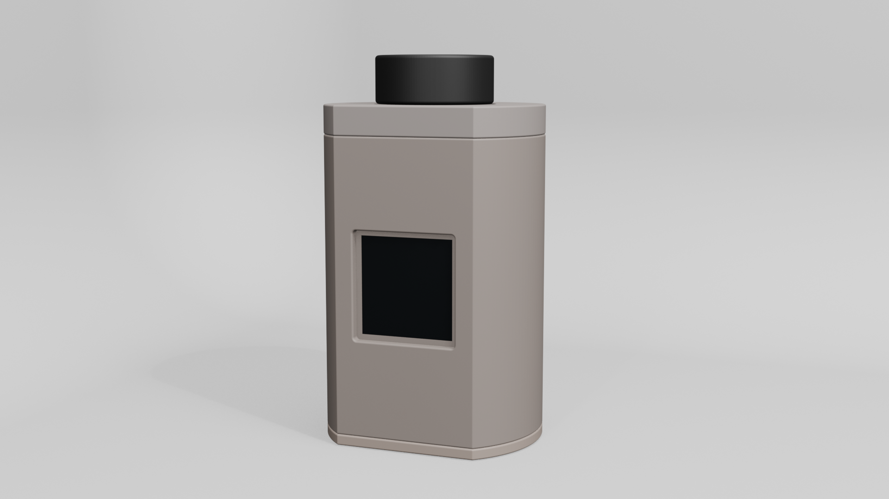

# Film Memory Player

以旋轉底片為互動概念的數位照片播放器。本儲存庫收錄兩種 ESP32 開發板版本；兩者共用同一份正式韌體，程式會依編譯目標自動套用對應的 GPIO。



## 硬體版本

| 版本 | 開發板 | 專案文件 |
| --- | --- | --- |
| XIAO ESP32-C3 | Seeed Studio XIAO ESP32-C3 | [進入專案](xiao-esp32c3/README.md) |
| ESP32-S3 Super Mini | 具 B+ / B- 電池焊盤的 ESP32-S3 Super Mini | [進入專案](esp32-s3-super-mini/README.md) |

正式程式位於 [`firmware/FilmMemoryPlayer/`](firmware/FilmMemoryPlayer/)，只需在 Arduino IDE 選擇正確開發板。各版本資料夾保留接線說明、材料清單與元件測試程式。外殼的 STL 檔可到 [`3d-print-parts/`](3d-print-parts/) 取得。

## 資料夾導覽

```text
.
├─ 3d-print-parts/          外殼的 3D 列印零件
├─ firmware/
│  └─ FilmMemoryPlayer/     S3 與 C3 共用的正式韌體
├─ xiao-esp32c3/            XIAO ESP32-C3 接線、測試與說明
└─ esp32-s3-super-mini/     ESP32-S3 Super Mini 接線、測試與說明
```
